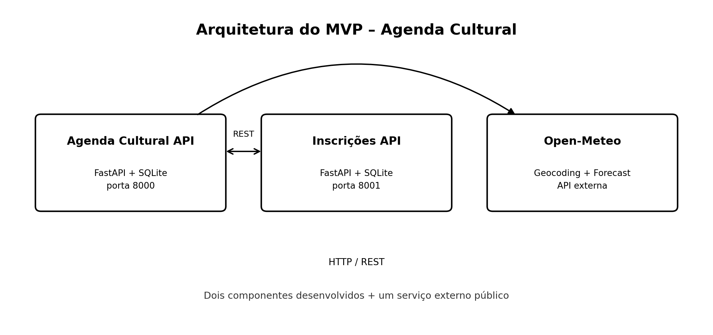

# Agenda Cultural API

API principal de um MVP voltado ao gerenciamento de eventos culturais.

A aplicação permite cadastrar, consultar, atualizar e excluir eventos. Também consulta a API pública Open-Meteo para obter informações climáticas da cidade do evento e se comunica com a API de inscrições para visualizar participantes e vagas disponíveis.

## Tecnologias

- Python 3.12
- FastAPI
- SQLAlchemy
- SQLite
- HTTPX
- Docker
- Docker Compose
- Open-Meteo

## Arquitetura



A solução possui três componentes:

1. Agenda Cultural API: componente principal responsável pelos eventos.
2. Inscrições API: componente responsável pelas inscrições dos participantes.
3. Open-Meteo: serviço externo usado para localização e clima atual.

A comunicação entre os componentes utiliza HTTP e REST.

## Rotas principais

| Método | Rota | Função |
|---|---|---|
| POST | `/eventos` | Cadastrar evento |
| GET | `/eventos` | Listar eventos |
| GET | `/eventos/{evento_id}` | Consultar evento |
| PUT | `/eventos/{evento_id}` | Atualizar evento |
| DELETE | `/eventos/{evento_id}` | Excluir evento |
| GET | `/eventos/{evento_id}/clima` | Consultar clima pela Open-Meteo |
| GET | `/eventos/{evento_id}/inscricoes` | Consultar inscrições na segunda API |
| GET | `/health` | Verificar funcionamento |

## API externa

Foi utilizada a Open-Meteo.

A API oferece acesso gratuito para uso não comercial, sem necessidade de chave de API. Os dados meteorológicos são disponibilizados sob licença CC BY 4.0 e exigem atribuição.

Endpoints utilizados:

- `https://geocoding-api.open-meteo.com/v1/search`
- `https://api.open-meteo.com/v1/forecast`

Documentação:

- https://open-meteo.com/en/docs
- https://open-meteo.com/en/docs/geocoding-api

## Execução com Docker Compose

Os dois repositórios devem estar na mesma pasta:

```text
mvp_eventos/
├── eventos-api/
└── inscricoes-api/
```

Entre na pasta `eventos-api`:

```bash
cd eventos-api
docker compose up --build
```

Depois da inicialização:

- API principal: http://localhost:8000
- Swagger principal: http://localhost:8000/docs
- API de inscrições: http://localhost:8001
- Swagger de inscrições: http://localhost:8001/docs

## Execução local

Crie o ambiente virtual:

```bash
python -m venv .venv
```

Ative o ambiente.

Windows:

```bash
.venv\Scripts\activate
```

Linux/macOS:

```bash
source .venv/bin/activate
```

Instale as dependências:

```bash
pip install -r requirements.txt
```

Execute:

```bash
uvicorn app.main:app --reload --port 8000
```

Para funcionar sem Docker, a API de inscrições deve estar em execução na porta 8001.

## Exemplo de cadastro

```json
{
  "titulo": "Festival Cultural da Cidade",
  "descricao": "Evento com música, gastronomia e apresentações culturais.",
  "cidade": "Rio de Janeiro",
  "local": "Praça Mauá",
  "data_evento": "2026-10-10",
  "capacidade": 500
}
```

## Persistência

Os eventos são armazenados em SQLite no arquivo `data/eventos.db`.

O arquivo do banco é criado automaticamente na primeira execução.
